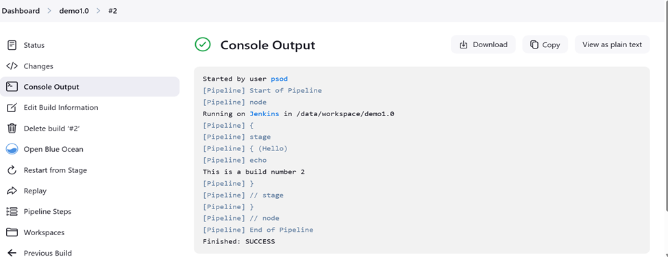
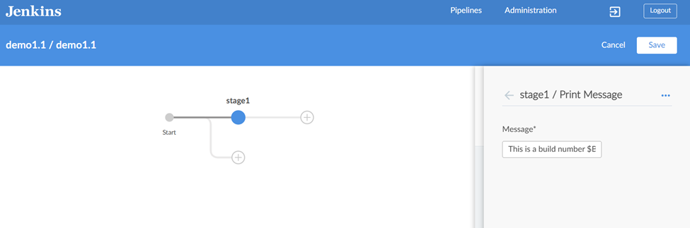
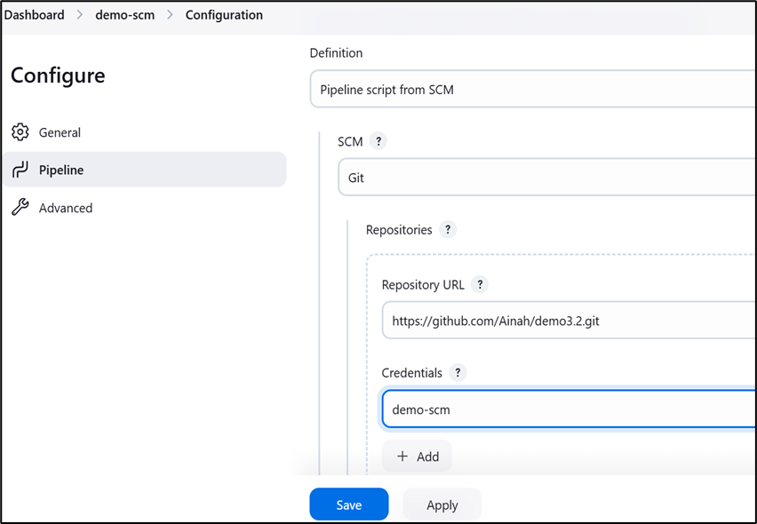

# Demo 1
Creating and running simple pipelines.

## Pre-reqs
Run Jenkins in [Docker](https://www.docker.com/products/docker-desktop):
```
docker compose -f docker-compose.yml up -d
```
or 
```
podman compose -f docker-compose.yml up -d
```

> Plugins configured in [install-plugins.groovy](../25.02/scripts/install-plugins.groovy)

## History Challenge: Banking Sector Pipeline Evolution

As part of this demo, imagine you are part of a banking institution's DevOps team tasked with modernizing their CI/CD pipelines. Your goal is to create and improve pipelines that reflect the evolution of software delivery.

## Scenario:
In the early days, the bank's IT team manually deployed applications, leading to delays and errors. Over time, they adopted automation to improve efficiency and reliability. Your task is to simulate this evolution by building pipelines that reflect different stages of maturity.

## 1.0 Manual Deployment Simulation (Create a simple pipeline)
Log into Jenkins at http://localhost:8080 with `admin`/`AwesomePass@cicd`.

- New item, pipeline, `demo1.0`
- Select sample pipeline script
- Replace echo with `echo "This my first echo build number $BUILD_NUMBER for my Banking Company"`
- Run and check output



## 1.1 Create a pipeline with Blue Ocean - Source Control Integration

Browse to http://localhost:8080/blue
- New pipeline
- Github repo - https://github.com/your_repo_username/demo1.0.git
- Log in with Github creds
> Needs write access to repo

- Build pipeline
- Add environment variable `DEMO=1.1`
- Add stage
- Add _Print message_ `This is build $BUILD_NUMBER of demo $DEMO`
- Run and check: doesn't interpolate strings
- View Jenkinsfile in repo:editor only uses single quotes
- Replace with shell script `echo "This is build $BUILD_NUMBER of demo $DEMO"`




## 1.2 Create a pipeline using classic mode - Git repository

Back in the classic UI http://localhost:8080
- New item, pipeline, `demo1.2`
- Select pipeline from source control
- Git - https://github.com/your_repo_username/demo1.0.git

> Walk through the [Jenkinsfile](demo1/demo1.0/Jenkinsfile)

- Run and check 
- Repeat stage

