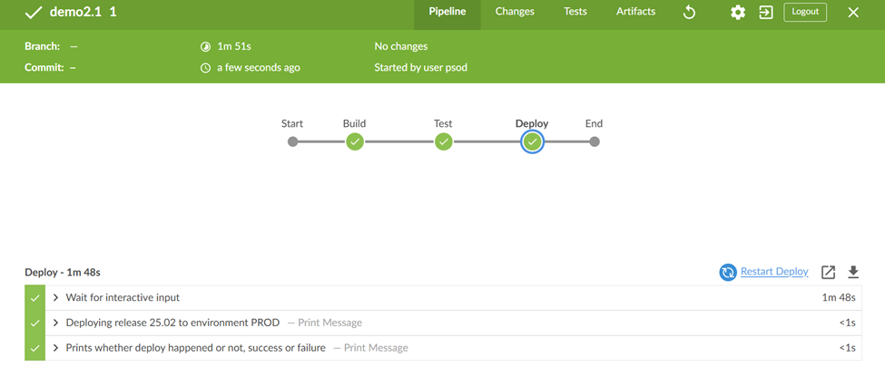
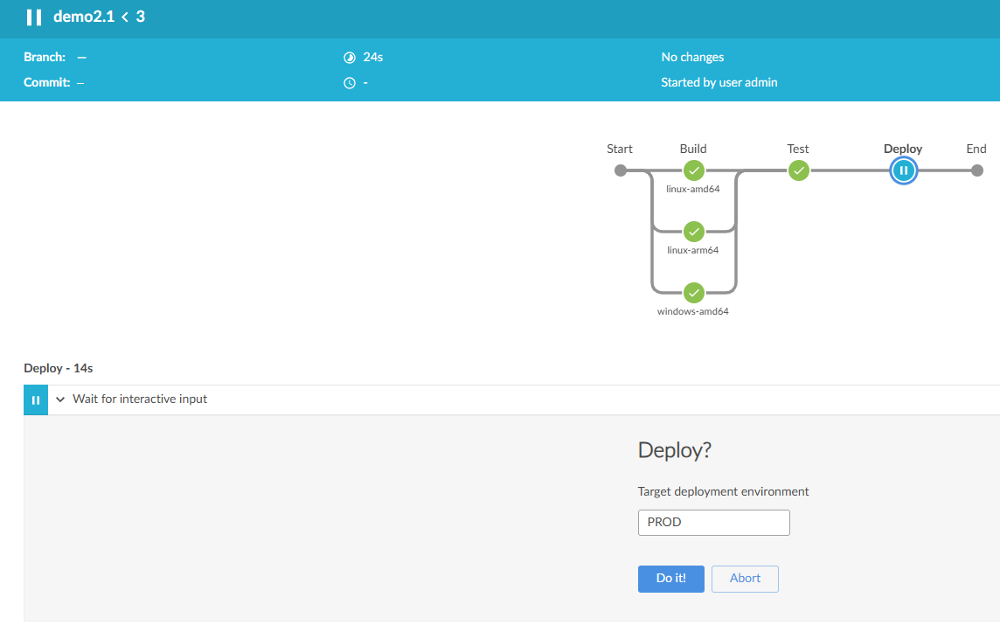

# Demo 2

Modelling workflows in pipelines

## Pre-reqs
Run Jenkins in [Docker](https://www.docker.com/products/docker-desktop):
```
docker-compose -f docker-compose.yml up -d
```
or 
```
podman compose -f docker-compose.yml up -d
```

## History Challenge: Workflow Automation
Imagine you are part of a banking institution's DevOps team tasked with automating workflows for critical banking applications. These workflows include fraud detection, transaction processing, and compliance checks. Your goal is to model these workflows in Jenkins pipelines, ensuring efficiency, reliability, and compliance with banking regulations.


## 2.0 A multi-stage pipeline
Log into Jenkins at http://localhost:8080 with `admin`/`AwesomePass@cicd`.

- New item, pipeline, `demo2.0`
- Select pipeline from source control
- Git - https://github.com/your_repo_username/demo2.0.git
- Path to Jenkinsfile `demo2/demo2.0/Jenkinsfile`

> Walk through the [Jenkinsfile](./demo2.0/Jenkinsfile)

- Run and check 



### Challenge
1. **Fraud Detection Workflow**:
   - Add a stage to simulate fraud detection by processing a mock dataset.
   - Use a shell script to print: `echo "Fraud detection completed for transaction batch $BUILD_NUMBER"`.

2. **Transaction Processing**:
   - Add a stage to simulate transaction processing.
   - Use a shell script to print: `echo "Processed transactions for batch $BUILD_NUMBER"`.

3. **Compliance Check**:
   - Add a stage to simulate compliance checks.
   - Use a shell script to print: `echo "Compliance check passed for batch $BUILD_NUMBER"`.


## 2.1 Requesting user input and add Parallel stages

Back to http://localhost:8080

- Copy item, `demo2.1` from `demo2.0`
- Path to Jenkinsfile `demo2/demo2.1/Jenkinsfile`

> Walk through the [Jenkinsfile](./demo2.1/Jenkinsfile)

- Run and check
- Parallel stages complete in any order
- Pauses on input stage - OK or abort
- Post runs every time



### Challenge:
1. **Approval for High-Value Transactions**:
   - Add an input stage to request user approval for processing high-value transactions.
   - Simulate this with a message: `echo "Approval granted for high-value transactions in batch $BUILD_NUMBER"`.

2. **Parallel Fraud and Compliance Checks**:
   - Add parallel stages to run fraud detection and compliance checks simultaneously.
   - Ensure both stages complete before proceeding to the next stage.