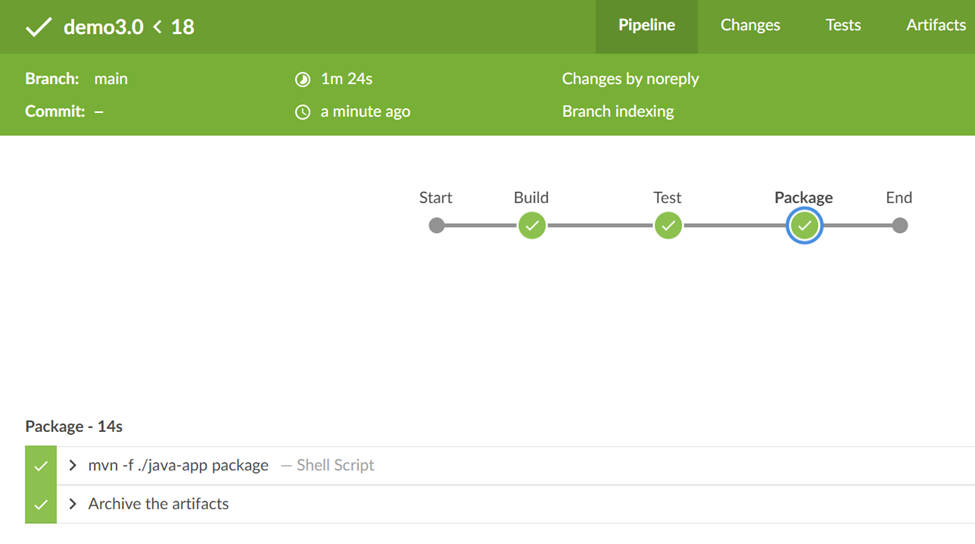
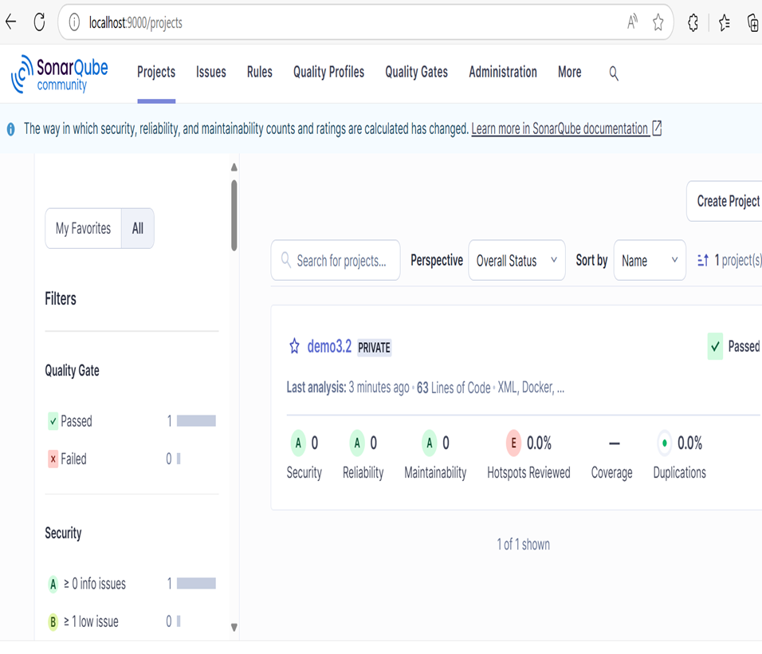
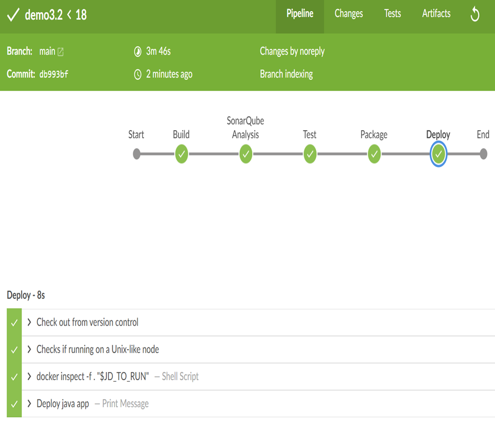

# Demo 3

Modelling workflows in pipelines to build , test and deploy a java application 

## Pre-reqs
Run Jenkins in [Docker](https://www.docker.com/products/docker-desktop):
```
docker-compose -f ../docker-compose.yml up -d
```
or 
```
podman compose -f docker-compose.yml up -d
```

## Challenge History: Application Deployment Automation
Imagine you are part of a banking institution's DevOps team tasked with automating the build, test, and deployment workflows for a critical banking application. This application handles sensitive operations such as customer account management, loan processing, and transaction monitoring. Your goal is to ensure the application is built, tested, and deployed efficiently and securely while adhering to banking regulations.


## 3.0 A building , testing and packaging Java app pipeline

Log into Jenkins at http://localhost:8080 with `admin`/`AwesomePass@cicd`.

- New item, pipeline, `demo3.0`
- Select pipeline from source control
- Git - https://github.com/your_repo_username/demo3.0.git
- Path to Jenkinsfile `demo3.0/Jenkinsfile`

> Walk through the [Jenkinsfile](demo3.0/Jenkinsfile)

- Run and check 
- Verify artifacts files
- Challenge: Add one more stage which package the java application app into jar files



## 3.1 Deploy Java application in docker - create image docker

Back to http://localhost:8080

- Copy item, `demo3.1` from3.0`
- Path to Jenkinsfile `demo3/demo3.1/Jenkinsfile`

> Walk through the [Jenkinsfile](./demo3.1/Jenkinsfile)

- Run and check
- Verify artifacts files
- Verify docker image create
- Challenge: Connect your docker hub account into jenkins. Create credentials in jenkins configuration


## 3.2 Deploy Java application in docker - and scan code with sonar before testing

### Preqs
Start and create sonarqube container

Run Sonarqube
```
docker-compose -f ./docker-compose.yml up -d
```

Go to http://localhost:9090 with with `admin`/`admin` then modify to `admin`/`AwesomePass@cicd2`
- Create your first project in sonarqube
- Get your token and add it into your jenkins configuration



### Add pipeline in jenkins
Back to http://localhost:8080

- Copy item, `demo3.2` from3.1`
- Path to Jenkinsfile `demo3/demo3.2/Jenkinsfile`
- Add your project in your Github repository
- Then, create your pipeline for the demo3.2

> Walk through the [Jenkinsfile](./demo3.2/Jenkinsfile)

- Run and check
- Verify artifacts files



### Challenge:
1. **Code Quality Enforcement**:
   - Add a stage to fail the pipeline if the SonarQube quality gate is not passed.
   - Simulate a scenario where the bank enforces strict code quality standards.

2. **Security Scanning**:
   - Integrate a security scanning tool like OWASP Dependency-Check.
   - Ensure the pipeline fails if vulnerabilities are detected.


## 3.3 Deploy Java application in tomcat Server
Back to http://localhost:8080

- Copy item, `demo3.3` from3.2`
- Path to Jenkinsfile `demo3/demo3.3/Jenkinsfile`
- Add your project in your Github repository
- Then, create your pipeline for the demo3.3

> Walk through the [Jenkinsfile](./demo3.3/Jenkinsfile)

- Run and check

### Challenges:
1. **Tomcat Deployment**:
   - Set up your own Tomcat server (locally, in a container, or on a remote platform such as AWS, Azure, or GCP).
   - Configure the server to deploy the Java application.
   - Add a `deploy` stage in the Jenkins pipeline to deploy the `.war` file to the Tomcat server.

2. **Post-Deployment Notification**:
   - Add a post-action to notify stakeholders when the pipeline completes.
   - Simulate this with a message: `echo "Deployment of Banking App version $BUILD_NUMBER completed successfully"`.

3. **Blue-Green Deployment**:
   - Implement a blue-green deployment strategy to minimize downtime during deployment.


